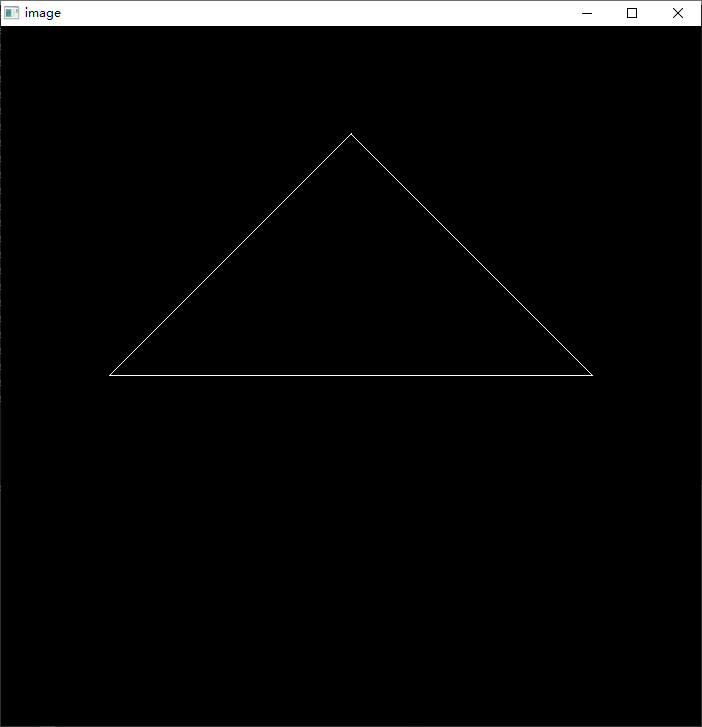
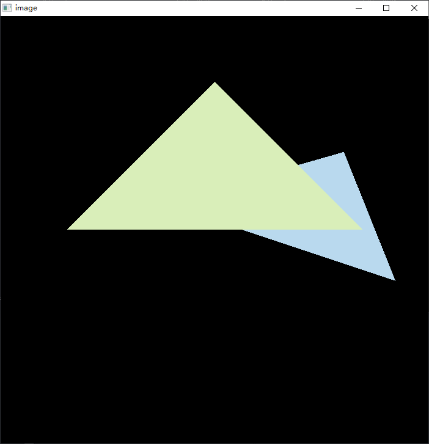
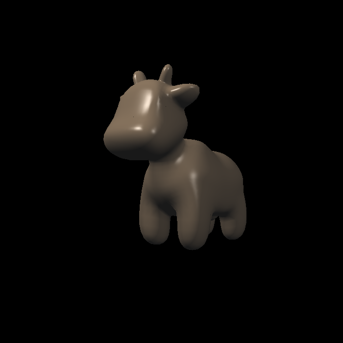
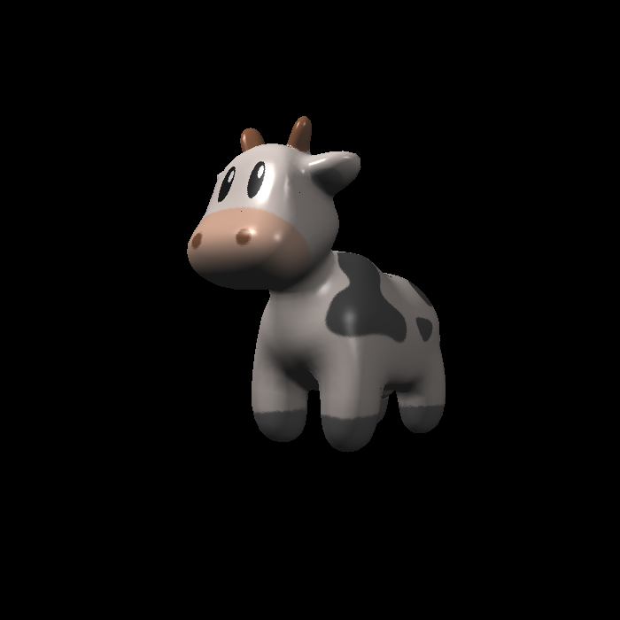
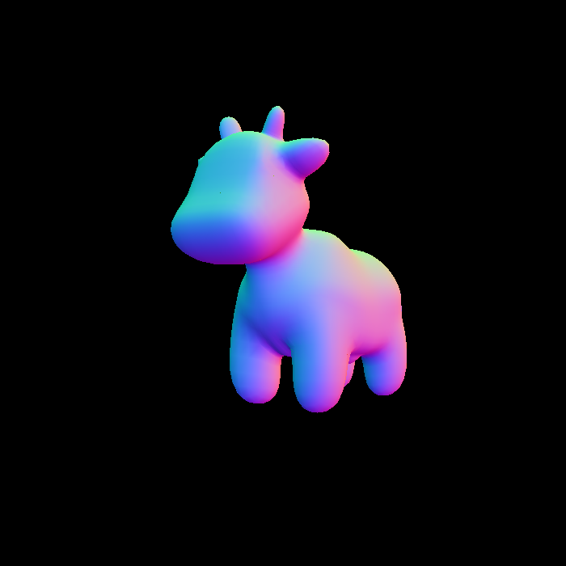
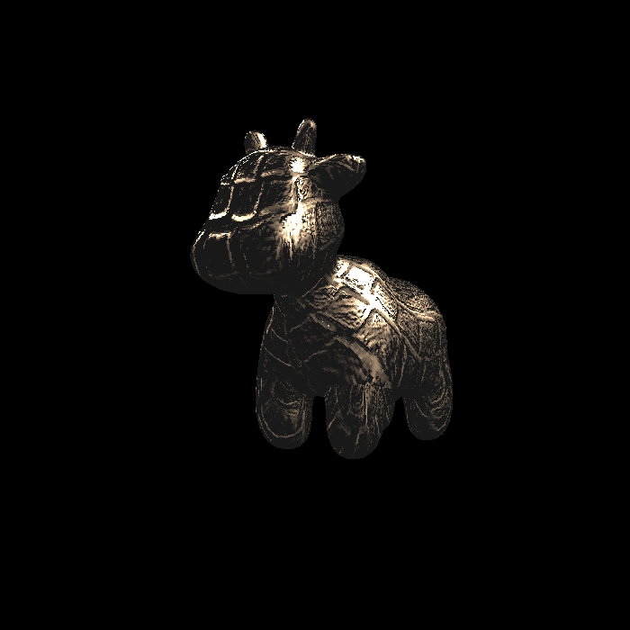
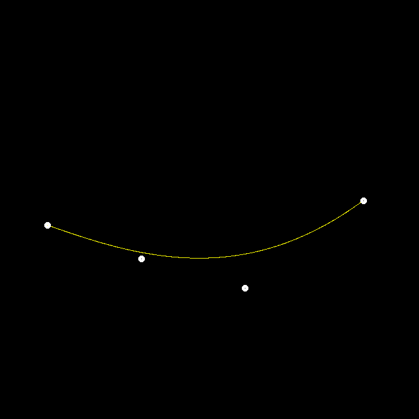
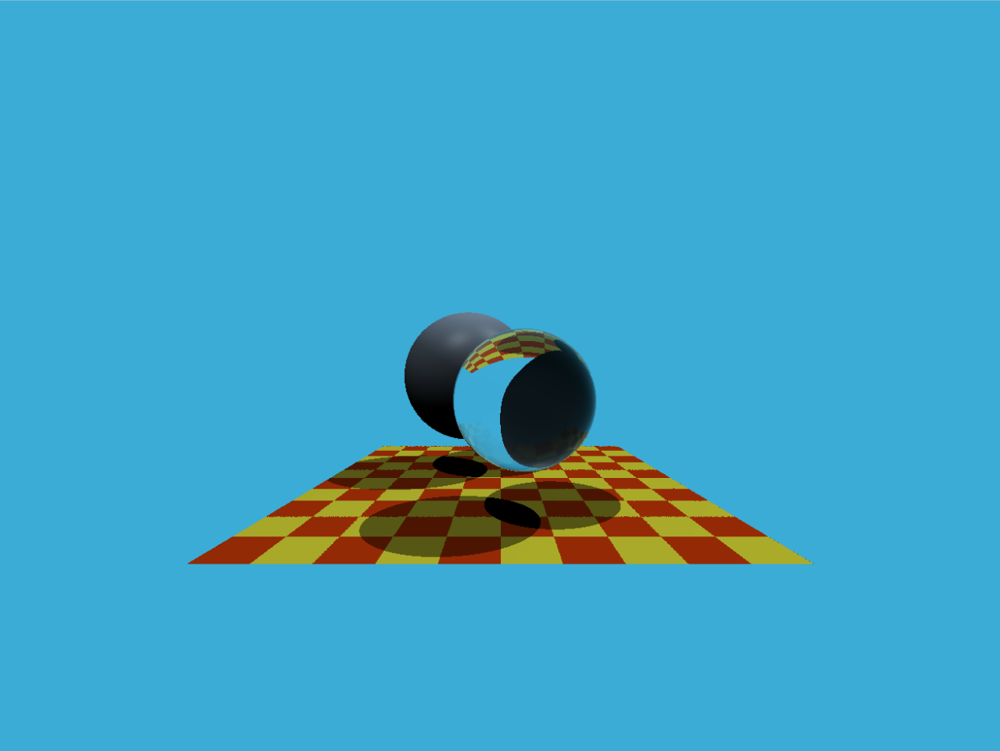

# GAMES101 Homework
Completed to Assignment 5...

Lecture link: [GAMES101-现代计算机图形学入门-闫令琪](https://www.bilibili.com/video/BV1X7411F744)

| Assignment1 | Assignment2 |
| :--: | :--: |
|              |    |

## Assignment3

| phong | texture | normal | bump | displacement |
| :--: | :--: | :--: | :--: | :--: |
|              |    |  |  |   |

| Assignment4 | Assignment5 |
| :--: | :--: |
|              |    |