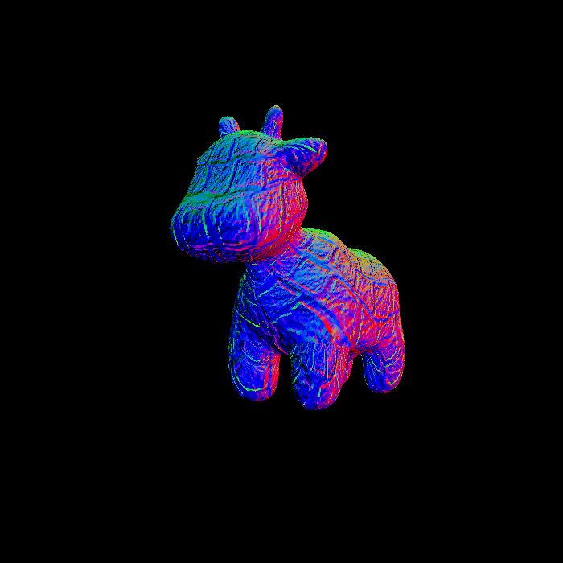

# GAMES101 Homework
Completed to Assignment 5...

Lecture link: [GAMES101-现代计算机图形学入门-闫令琪](https://www.bilibili.com/video/BV1X7411F744)

## Assignment1

## Assignment2

## Assignment3

- phong

- texture

- normal

- bump

- displacement

## Assignment4

## Assignment5
